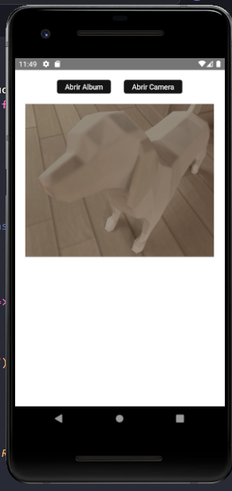

###  AppCarinhoDeCompras

### Instalação do react-native-image-picker

yarn add react-native-image-picker

import {launchCamera, launchImageLibrary} from 'react-native-image-picker';

https://github.com/react-native-image-picker/react-native-image-picker

### Configurando Permissão da camera android/IOS

## Android/App/src/main/AndroidManifest.xml

    <uses-permission android:name="android.permission.WRITE_EXTERNAL_STORAGE" />

   ## iOS/App/src/info.plist

     <key>NSPhotoLibraryUsageDescription</key>
	<string>SelectImage</string>

	<key>NSCameraUsageDescription</key>
	<string>CaptureImage</string>

	<key>NSMicrophoneUsageDescription</key>
	<string>CaptureMicro</string>

#### Tela do App

